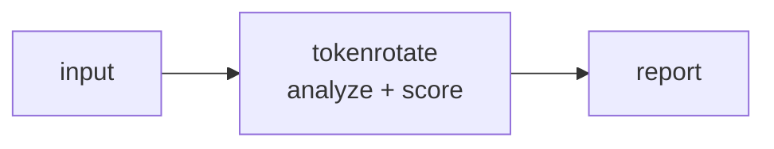

<a name="top"></a>
<div align="center">


# TOKENROTATE

### Plan + track secret rotation across providers from an inventory


[](https://pypi.org/project/cognis-tokenrotate/) [](https://github.com/cognis-digital/tokenrotate/actions) [](LICENSE) [](https://github.com/cognis-digital)

*Part of the Cognis Neural Suite.*

</div>

```bash
pip install cognis-tokenrotate
tokenrotate scan .            # → prioritized findings in seconds
```


<!-- cognis:example:start -->
## 🔎 Example output

Real, reproducible output from the tool — runs offline:

```console
$ tokenrotate-emit --version
tokenrotate 0.1.0
```

```console
$ tokenrotate-emit --help
usage: tokenrotate [-h] [--version] {plan,report,check} ...

Plan and track secret rotation across providers from an inventory.

positional arguments:
  {plan,report,check}
    plan               print ordered rotation plan
    report             print roll-up summary
    check              exit non-zero if any secret is overdue/unknown (CI
                       gate)

options:
  -h, --help           show this help message and exit
  --version            show program's version number and exit
```

> Blocks above are real `tokenrotate` output — reproduce them from a clone.

**Sample result format** _(illustrative values — run on your own data for real findings):_

```
{
"findings": [
    {
        "id": "123456",
        "title": "Suspicious Network Traffic",
        "description": "Anomalous network traffic detected from IP 192.168.1.100",
        "severity": "high",
        "created_at": "2023-02-15T14:30:00Z"
    },
    {
        "id": "789012",
        "title": "Malware Detection",
        "description": "Malware detected on host 192.168.1.101",
        "severity": "medium",
        "created_at": "2023-02-15T14:35:00Z"
    }
]
}
```

<!-- cognis:example:end -->

## Usage — step by step

1. **Install** (Python 3.9+):

   ```bash
   pip install tokenrotate
   ```

2. **Print an ordered rotation plan** from a secret inventory JSON:

   ```bash
   tokenrotate plan inventory.json
   ```

3. **Get a roll-up summary** of rotation status across providers:

   ```bash
   tokenrotate report inventory.json
   ```

4. **Read the output as JSON** for tooling (each subcommand accepts `--format`):

   ```bash
   tokenrotate plan inventory.json --format json | jq '.[]'
   ```

5. **Gate in CI.** `check` exits non-zero when any secret is overdue or has an unknown age:

   ```bash
   tokenrotate check inventory.json || echo "Secrets overdue for rotation"
   ```


## Contents

- [Why tokenrotate?](#why) · [Features](#features) · [Quick start](#quick-start) · [Example](#example) · [Architecture](#architecture) · [AI stack](#ai-stack) · [How it compares](#how-it-compares) · [Integrations](#integrations) · [Install anywhere](#install-anywhere) · [Related](#related) · [Contributing](#contributing)

<a name="why"></a>
## Why tokenrotate?

rotation made boring

`tokenrotate` is single-purpose, scriptable, and self-hostable: point it at a target, get prioritized results in the format your workflow already speaks (table · JSON · SARIF), gate CI on it, and let agents drive it over MCP.

<div align="right"><a href="#top">↑ back to top</a></div>

<a name="features"></a>
## Features

- ✅ Load Inventory
- ✅ Build Plan
- ✅ Summarize
- ✅ Runs on Linux/macOS/Windows · Docker · devcontainer
- ✅ Ports in Python, JavaScript, Go, and Rust (`ports/`)

<div align="right"><a href="#top">↑ back to top</a></div>

<a name="quick-start"></a>
## Quick start

```bash
pip install cognis-tokenrotate
tokenrotate --version
tokenrotate scan .                       # scan current project
tokenrotate scan . --format json         # machine-readable
tokenrotate scan . --fail-on high        # CI gate (non-zero exit)
```

<div align="right"><a href="#top">↑ back to top</a></div>

<a name="example"></a>
## Example

```text
$ tokenrotate scan .
  [HIGH    ] TOK-001  example finding             (./src/app.py)
  [MEDIUM  ] TOK-002  another signal              (./config.yaml)

  2 findings · risk score 5 · 38ms
```

<div align="right"><a href="#top">↑ back to top</a></div>

<a name="architecture"></a>
## Architecture



<div align="right"><a href="#top">↑ back to top</a></div>

<a name="ai-stack"></a>
## Use it from any AI stack

`tokenrotate` is interoperable with every popular way of using AI:

- **MCP server** — `tokenrotate mcp` (Claude Desktop, Cursor, Cognis.Studio, [uncensored-fleet](https://github.com/cognis-digital/uncensored-fleet))
- **OpenAI-compatible / JSON** — pipe `tokenrotate scan . --format json` into any agent or LLM
- **LangChain · CrewAI · AutoGen · LlamaIndex** — wrap the CLI/JSON as a tool in one line
- **CI / scripts** — exit codes + SARIF for non-AI pipelines

<div align="right"><a href="#top">↑ back to top</a></div>

<a name="how-it-compares"></a>
## How it compares

| | **Cognis tokenrotate** | - |
|---|:---:|:---:|
| Self-hostable, no account | ✅ | varies |
| Single command, zero config | ✅ | ⚠️ |
| JSON + SARIF for CI | ✅ | varies |
| MCP-native (AI agents) | ✅ | ❌ |
| Polyglot ports (JS/Go/Rust) | ✅ | ❌ |
| Open license | ✅ COCL | varies |

*Built in the spirit of **-**, re-framed the Cognis way. Missing a credit? Open a PR.*

<div align="right"><a href="#top">↑ back to top</a></div>

<a name="integrations"></a>
## Integrations

Pipes into your stack: **SARIF** for code-scanning, **JSON** for anything, an **MCP server** (`tokenrotate mcp`) for AI agents, and a webhook forwarder for SIEM/Slack/Jira. See [`docs/INTEGRATIONS.md`](docs/INTEGRATIONS.md).

<div align="right"><a href="#top">↑ back to top</a></div>

<a name="install-anywhere"></a>
## Install — every way, every platform

```bash
pip install "git+https://github.com/cognis-digital/tokenrotate.git"    # pip (works today)
pipx install "git+https://github.com/cognis-digital/tokenrotate.git"   # isolated CLI
uv tool install "git+https://github.com/cognis-digital/tokenrotate.git" # uv
pip install cognis-tokenrotate                                          # PyPI (when published)
docker run --rm ghcr.io/cognis-digital/tokenrotate:latest --help        # Docker
brew install cognis-digital/tap/tokenrotate                             # Homebrew tap
curl -fsSL https://raw.githubusercontent.com/cognis-digital/tokenrotate/main/install.sh | sh
```

| Linux | macOS | Windows | Docker | Cloud |
|---|---|---|---|---|
| `scripts/setup-linux.sh` | `scripts/setup-macos.sh` | `scripts/setup-windows.ps1` | `docker run ghcr.io/cognis-digital/tokenrotate` | [DEPLOY.md](docs/DEPLOY.md) (AWS/Azure/GCP/k8s) |

<div align="right"><a href="#top">↑ back to top</a></div>

<a name="related"></a>
## Related Cognis tools

- [`portfan`](https://github.com/cognis-digital/portfan) — Summarize and diff nmap XML into prioritized, attackable findings
- [`subhunt`](https://github.com/cognis-digital/subhunt) — Aggregate & dedupe subdomain enumeration from multiple sources
- [`dirsight`](https://github.com/cognis-digital/dirsight) — Analyze web content-discovery output (ffuf/gobuster) into ranked endpoints
- [`jwtinspect`](https://github.com/cognis-digital/jwtinspect) — Decode JWTs and lint for alg=none, weak secrets, and missing claims
- [`corsaudit`](https://github.com/cognis-digital/corsaudit) — Detect permissive/misconfigured CORS from headers or a config
- [`headerscan`](https://github.com/cognis-digital/headerscan) — Grade HTTP security headers (CSP/HSTS/XFO) A-F from a response dump

**Explore the suite →** [🗂️ all 170+ tools](https://github.com/cognis-digital/cognis-neural-suite) · [⭐ awesome-cognis](https://github.com/cognis-digital/awesome-cognis) · [🔗 cognis-sources](https://github.com/cognis-digital/cognis-sources) · [🤖 uncensored-fleet](https://github.com/cognis-digital/uncensored-fleet) · [🧠 engram](https://github.com/cognis-digital/engram)

<div align="right"><a href="#top">↑ back to top</a></div>

<a name="contributing"></a>
## Contributing

PRs, new rules, and demo scenarios are welcome under the collaboration-pull model — see [CONTRIBUTING.md](CONTRIBUTING.md) and [SECURITY.md](SECURITY.md).

> ### ⭐ If `tokenrotate` saved you time, **star it** — it genuinely helps others find it.

## Interoperability

`{}` composes with the 300+ tool Cognis suite — JSON in/out and a shared
OpenAI-compatible `/v1` backbone. See **[INTEROP.md](INTEROP.md)** for the
suite map, composition patterns, and reference stacks.

## License

Source-available under the **Cognis Open Collaboration License (COCL) v1.0** — free for personal, internal-evaluation, research, and educational use; **commercial / production use requires a license** (licensing@cognis.digital). See [LICENSE](LICENSE).

---

<div align="center"><sub><b><a href="https://cognis.digital">Cognis Digital</a></b> · one of 170+ tools in the <a href="https://github.com/cognis-digital/cognis-neural-suite">Cognis Neural Suite</a> · <i>Making Tomorrow Better Today</i></sub></div>
